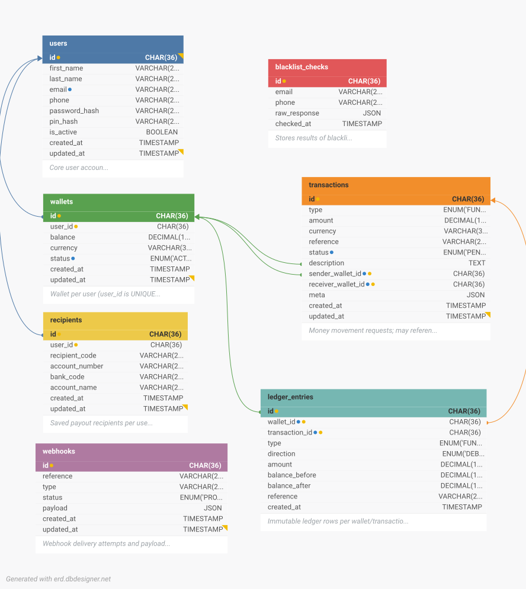

# Demo Credit — Wallet Service

An MVP wallet service built for the Lendsqr Backend Engineering Assessment.

Demo Credit allows users to create accounts, fund wallets, transfer funds to 
other users, and withdraw to bank accounts — with Adjutor Karma blacklist 
verification on onboarding and Paystack-powered payment processing.

- **Live API:** https://ajala-feranmi-lendsqr-be-test.onrender.com/api
- **API Docs:** https://ajala-feranmi-lendsqr-be-test.onrender.com/api-docs
- **Document:** https://www.notion.so/Lendsqr-Backend-Engineer-Assessment-Ajala-Oluwaferanmi-35c9466ef8c580f59e22c108b946c209?source=copy_link

## Table of Contents

- [Stack](#stack)
- [Project Structure](#project-structure)
- [Architecture](#architecture)
- [Entity Relationship Diagram](#entity-relationship-diagram)
- [Local Setup](#local-setup)
- [Environment Variables](#environment-variables)
- [API Reference](#api-reference)
- [Running Tests](#running-tests)
- [Scripts](#scripts)

---

## Stack

| Layer | Technology |
|---|---|
| Runtime | Node.js LTS + TypeScript |
| Framework | Express.js |
| ORM | Knex.js |
| Database | MySQL (runtime), SQLite (tests) |
| Validation | Zod |
| Auth | JWT |
| Payments | Paystack |
| Testing | Jest + Supertest |
| Docs | Swagger (swagger-jsdoc) |

---

## Project Structure

```
src/
├── config/
│   ├── env.ts              # Zod env validation & dotenv loader
│   ├── logger.ts           # Winston logger configuration
│   └── swagger.ts          # Swagger/OpenAPI spec definition
├── controllers/
│   ├── AuthController.ts   # Login, register, profile, logout
│   ├── AccountsController.ts # Fund, withdraw, transfer, recipients
│   ├── WalletController.ts # Create wallet, fetch balance
│   ├── TransactionController.ts # List transactions, summary, filter
│   ├── PaystackWebhookController.ts # Webhook verification & replay
│   └── index.ts
├── services/
│   ├── UserService.ts      # User creation, password hashing
│   ├── WalletService.ts    # Wallet CRUD, balance queries
│   ├── AccountService.ts   # Fund, withdraw, transfer orchestration
│   ├── PaystackService.ts  # Paystack API adapter (live/mock mode)
│   ├── BlacklistService.ts # Adjutor verification
│   ├── WebhookService.ts   # Webhook handling & ledger updates
│   └── index.ts
├── repositories/
│   ├── BaseRepository.ts   # Generic DB abstraction with transaction support
│   ├── UserRepository.ts   # User queries
│   ├── WalletRepository.ts # Wallet queries
│   ├── TransactionRepository.ts # Transaction queries with classification
│   ├── LedgerRepository.ts # Ledger entry queries
│   ├── RecipientRepository.ts # Saved recipient queries
│   ├── BlacklistRepository.ts # Blacklist check records
│   ├── WebhookRepository.ts # Webhook event records
│   └── index.ts
├── routes/
│   ├── AuthRoutes.ts       # Auth endpoints (Swagger-documented)
│   ├── WalletRoutes.ts     # Wallet endpoints
│   ├── AccountRoutes.ts    # Account & money-movement endpoints
│   ├── TransactionRoutes.ts # Transaction query endpoints
│   ├── PaystackWebhookRoutes.ts # Webhook endpoint
│   └── index.ts
├── middlewares/
│   ├── authMiddleware.ts   # JWT verification
│   └── errorHandler.ts     # Centralized error handler
├── database/
│   ├── db.ts              # Knex instance & transaction helpers
│   └── migrations/        # Knex migration files
│       ├── 20260507212001_create_users_table.ts
│       ├── 20260507212002_create_wallets_table.ts
│       ├── 20260507212003_create_transactions_table.ts
│       ├── 20260507212004_create_ledger_entries_table.ts
│       ├── 20260507212005_create_blacklist_checks_table.ts
│       ├── 20260507212006_create_recipients_table.ts
│       ├── 20260507212007_add_meta_column_on_transactions_table.ts
│       └── 20260507212008_create_webhooks_table.ts
├── types/
│   └── swagger-jsdoc.d.ts # TypeScript definition for swagger-jsdoc
├── utils/
│   ├── jwt.ts             # JWT sign & verify helpers
│   ├── password.ts        # bcrypt hash & compare helpers
│   └── index.ts
├── app.ts                 # Express app setup & middleware registration
└── server.ts              # HTTP server entry point

tests/
├── helpers/
│   ├── db.ts             # Test DB setup & teardown
│   └── factories.ts      # Fixture builders (user, wallet, etc.)
├── mocks/
│   ├── paystack.ts       # Jest mocks for PaystackService
│   └── adjutor.ts        # Jest mocks for BlacklistService
├── setup.ts              # Test environment initialization
├── auth.controller.test.ts
├── accounts.controller.test.ts
├── webhook.controller.test.ts
└── blacklist.service.test.ts

.env.example              # Environment variable template
knexfile.ts              # Knex configuration for migrations
tsconfig.json            # TypeScript configuration
jest.config.js           # Jest test configuration
eslint.config.mjs         # ESLint rules
package.json              # Dependencies & npm scripts
README.md                 # This file
```

### Key Directory Highlights

**`src/config/`**: Centralized setup for environment, logging, and API docs.

**`src/controllers/`**: HTTP handlers that validate requests and delegate to services.

**`src/services/`**: Business logic and orchestration. Services call repositories and external APIs (Paystack, Adjutor).

**`src/repositories/`**: Database abstraction layer. All queries go through repos, which support optional transaction scoping for atomic operations.

**`src/routes/`**: Endpoint definitions with Swagger JSDoc comments for interactive docs at `/api-docs`.

**`src/database/`**: Knex migrations that define schema. Migrations are versioned and can be rolled back.

**`tests/`**: Jest test suite with factories for fixtures and mocks for external services. Tests use SQLite and run in isolation.

---

## Architecture

The application follows a **layered architecture** separating concerns across four tiers:

```
HTTP Request
    ↓
  Routes (Swagger-documented endpoints)
    ↓
  Controllers (request validation, orchestration)
    ↓
  Services (business logic, Paystack integration, ledger updates)
    ↓
  Repositories (database abstraction, transactions, pagination)
    ↓
  Database (MySQL with Knex query builder)
```

### Key Patterns

**Ledger-Centric Model**: Every financial transaction generates immutable ledger entries that audit balance changes. This enables:
- Complete transaction reversal on failure
- Financial audit trails
- Future fee support without balance recalculation

**Transactional Safety**: Critical money-movement operations (fund, transfer, withdraw) execute within Knex database transactions to ensure atomicity — all or nothing.

**Idempotency Keys**: Money endpoints require `idempotency_key` in requests to guarantee retry safety. Duplicate requests with the same key return the cached result.

**Repository Pattern**: All database queries flow through typed repositories that handle pagination, filtering, and optional transaction scoping. This improves testability and reusability.

**Services Layer**: Business logic lives in services (UserService, WalletService, PaystackService, WebhookService) which may coordinate multiple repositories and external APIs.

### External Integration

**Paystack**: 
- `live` mode uses real API for payments and bank lookups
- `mock` mode returns simulated responses for local development

**Adjutor (Lendsqr)**: Blacklist verification on user registration, controlled by `BLACKLIST_MODE` (strict/lenient/disabled).

**Webhooks**: Paystack events (`charge.success`, `transfer.success`, `transfer.failed`) are persisted, verified, and replayed to update wallet balances and transaction status.

---

## Entity Relationship Diagram



---

## Local Setup

### Prerequisites
- Node.js LTS
- MySQL running locally

### Install & Run

```bash
cp .env.example .env   # configure your environment variables
npm install
npm run migrate
npm run dev
```

---

## Environment Variables

| Variable | Description |
|---|---|
| `NODE_ENV` | `development`, `test`, or `production` |
| `PORT` | Server port |
| `DB_HOST` | MySQL host |
| `DB_PORT` | MySQL port |
| `DB_USER` | MySQL user |
| `DB_PASSWORD` | MySQL password |
| `DB_NAME` | MySQL database name |
| `JWT_SECRET` | JWT signing secret |
| `JWT_EXPIRES_IN` | JWT expiry duration |
| `PAYSTACK_SECRET_KEY` | Paystack secret key |
| `PAYSTACK_MODE` | `live` or `mock` |
| `SALT_ROUND` | bcrypt salt rounds |
| `ADJUTOR_API_KEY` | Lendsqr Adjutor API key |
| `ADJUTOR_BASE_URL` | Lendsqr Adjutor base URL |
| `BLACKLIST_MODE` | `strict`, `lenient`, or `disabled` |

Set `BLACKLIST_MODE=strict` and `PAYSTACK_MODE=live` for production.

Use `PAYSTACK_MODE=mock` to run the app locally without hitting the Paystack API.

---

## API Reference

Full interactive documentation is available at `/api-docs` when the server is running.

Base path: `/api`

| Method | Path | Description | Auth |
|---|---|---|---|
| POST | `/auth/register` | Register a new user | ❌ |
| POST | `/auth/login` | Login and receive JWT | ❌ |
| GET | `/auth/profile` | Get authenticated user profile | ✅ |
| POST | `/auth/logout` | Logout | ✅ |
| POST | `/wallets/create` | Create a wallet | ✅ |
| GET | `/wallets/my-wallet` | Get wallet details | ✅ |
| GET | `/accounts/banks` | List banks from Paystack | ✅ |
| POST | `/accounts/fund` | Initialize wallet funding | ✅ |
| POST | `/accounts/withdraw` | Withdraw to bank account | ✅ |
| POST | `/accounts/transfer` | Transfer to another wallet | ✅ |
| POST | `/accounts/bank-enquiry` | Resolve a bank account name | ✅ |
| POST | `/accounts/wallet-enquiry` | Verify a recipient wallet | ✅ |
| POST | `/accounts/add-recipient` | Save a bank recipient | ✅ |
| GET | `/accounts/recipients` | List saved recipients | ✅ |
| GET | `/transactions` | List transactions | ✅ |
| GET | `/transactions/summary` | Credit/debit totals | ✅ |
| GET | `/transactions/:id` | Get single transaction | ✅ |
| POST | `/paystack/webhook` | Paystack webhook receiver | ❌ |

Money movement endpoints (`fund`, `transfer`, `withdraw`) require an 
`idempotency_key` in the request body to prevent duplicate processing.

---

## Running Tests

```bash
npm test                  # run all tests
npm run test:coverage     # generate coverage report
```

Tests use SQLite and run entirely in isolation — no external DB or API 
calls required.

---

## Scripts

| Command | Description |
|---|---|
| `npm run dev` | Start development server |
| `npm run build` | Compile TypeScript |
| `npm start` | Run compiled output |
| `npm test` | Run test suite |
| `npm run test:coverage` | Coverage report |
| `npm run lint` | Lint source files |
| `npm run format` | Format source files |
| `npm run migrate` | Run migrations |
| `npm run migrate:make` | Create a new migration |
| `npm run seed:run` | Run seeds |
